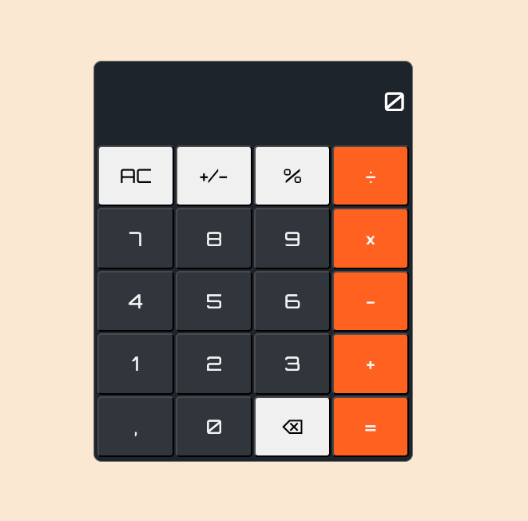

# Calculator

This project is a simple calculator with basic operations and supports keyboard input. Despite having a simple 
design and implementation, this project actually presented good challenges and many bugs to solve. 

Most of the bugs were about preventing unwanted behaviors like overflowing the display when the result is too 
big (>999999999) or too small (<0.00000001). When trying to solve one bug invariably others showed up, for 
instance, using exponential notation for big or small numbers introduced new bugs like 0 being displayed 
as 0e+0 but in the end it was a great opportunity for learning more about how JavaScript handles numbers 
and arithmetic operations.

You can see the project live at https://lucasbpaiva.github.io/calculator/

